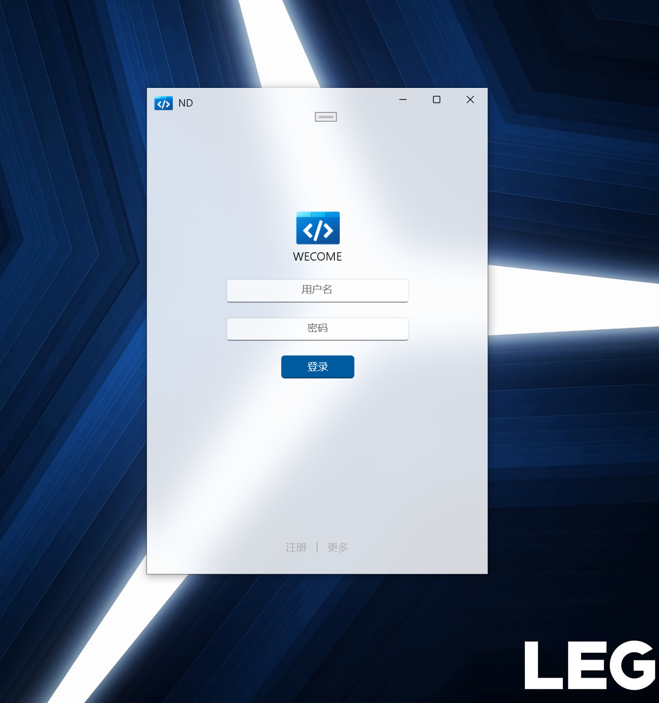
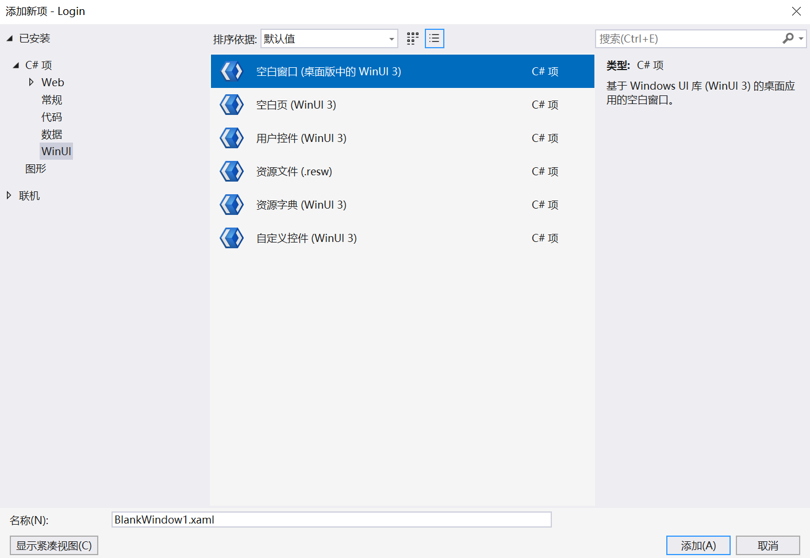

# winui3_Loginframe

首先说明，这个背景是亚克力效果的，但是呢，你如果是笔记本开了省电模式是无法渲染出亚克力效果的，这个还是要注意一下的

另外在开发项目时注意发生报错首先点击项目名称，然后右键清理，再执行一下试试看，如果你这个时候开着梯子，可以关掉，因为他可能要下载一些东西。

这算是一个初学者项目，总好过一开始就看MVVM模式的代码。

昨天也就是2024年10月21号还写了一个qml版本的，可以都交流一下

ok，以上就是我要说的，有问题可以提issue，that‘s all.

Have a good day and enjoy it !

2024年10月25日早06点29分

啥比vs，牛魔我一直以为这个image的resource的相对路径设不对是因为牛魔的exe所处的位置太过于深了（在很多层嵌套的文件夹里），结果牛魔是把新复制进去的文件屏蔽了？？？那我请问？？？

现在发现这个winui3 tmplate studio早就不更新了，得省省吧，在这个页面上继续写一个主页面

初步的构思是能作为一个家用NAS的客户端系统吧，那就再这个基础上继续写吧

噢，这个项目是从下图开始的，记得先装NuGet的WinUIEx

